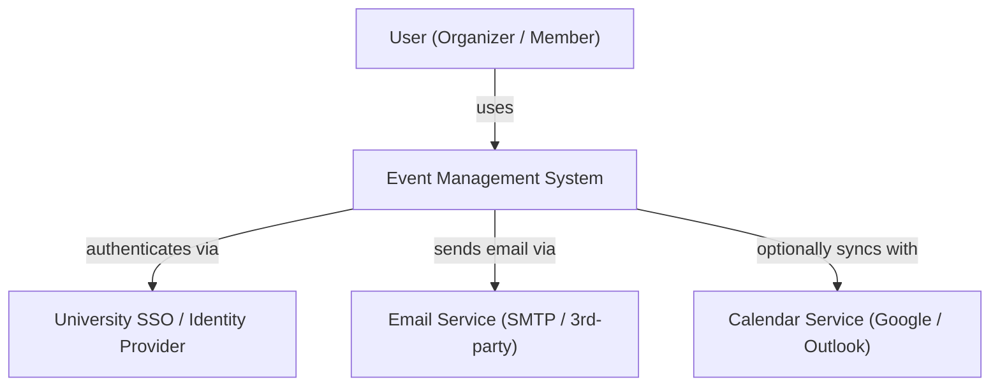
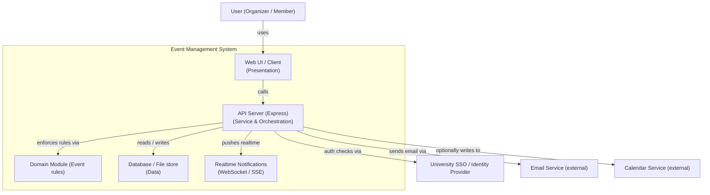
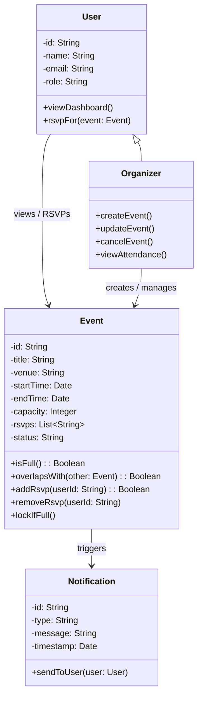
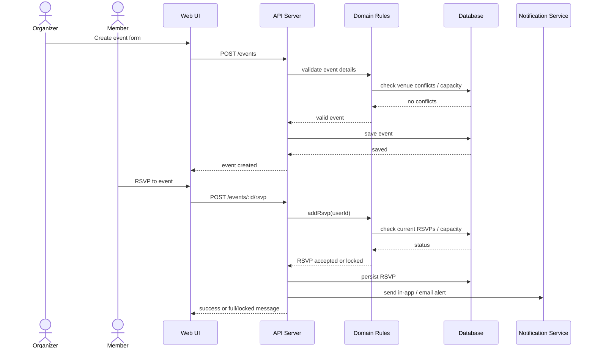

Event Management System

<!-- CI badge: after Session 4, replace ORG/REPO and the workflow filename, then uncomment:

-->

**Student:** [Jonathan Morency] · **Course:** CEN 5064 Software Design, Fall 2026 · **Partner:** [@cmend137]

## Project (approval paragraph — write this by Sun Aug 30)

Project Name: Event Management System
This is a web-based application is designed for university student organizations to create, organize, and RSVP 
events. It will centralize the event information through a dashboard where the user can view upcoming events, manage 
existing events and track attendance. This system will be for student organization administrators and members. 3 main 
features of the system would be 1, the homepage dashboard; 2, the event creation and management feature which will enforce
the business rules such as preventing overlapping event schedules and venues, as well as locking events when they reach full 
capacity; and 3, the event notification feature shown through an in-app banner that will notify organization administrators 
of any changes to the amount of members currently RSVP'd to an event, and notify organization members of any changes to 
the time and place of a venue they RSVP'd or if the event had been cancelled.

[One paragraph: What is the system? Who is it for? What are its 3–4 core features?
This paragraph is your approval request — see the Project Brief, Section 2.]

## How to run

```
[Exact commands to build and run your system from a clean clone.
Update this every time the steps change — your partner and your
instructor will follow it literally on conference days.]
```

## Architecture

### Tier breakdown (Session 2 studio)

| Tier | Responsibilities in THIS system |
|------|--------------------------------|
| Presentation | [what your UI layer does] |
| Service | [what your use-case/orchestration layer does] |
| Domain | [your entities and business rules] |
| Data | [how and where data is stored] |

### C4 — Context & Container (Session 3 studio)





### UML — Class & Sequence (Session 3 studio)





## Architecture Decision Records

Decisions live in [`docs/adr/`](docs/adr/). Start with ADR-001 in Session 4.

| # | Decision | Status |
|---|----------|--------|
| [001](docs/adr/adr-001.md) | [What I am building and why] | [proposed] |

## Weekly log (optional but recommended)

A one-line note per week keeps your commit story readable:

- Week 1 (Aug 24): repo created, three ideas drafted
- Week 2 (Aug 31): ...
